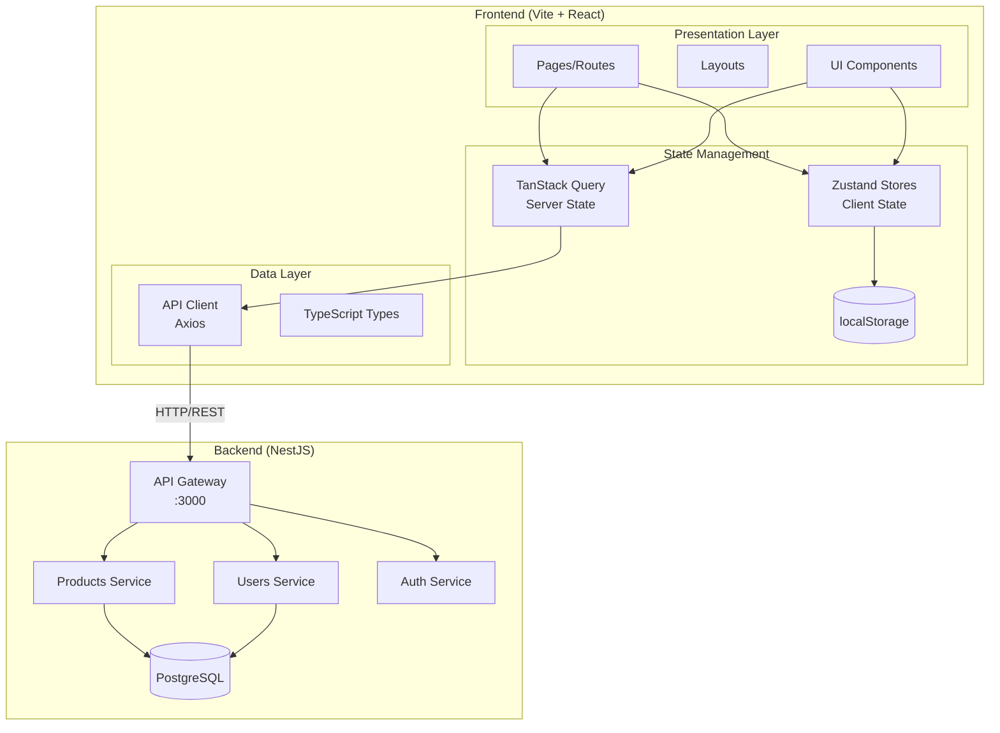
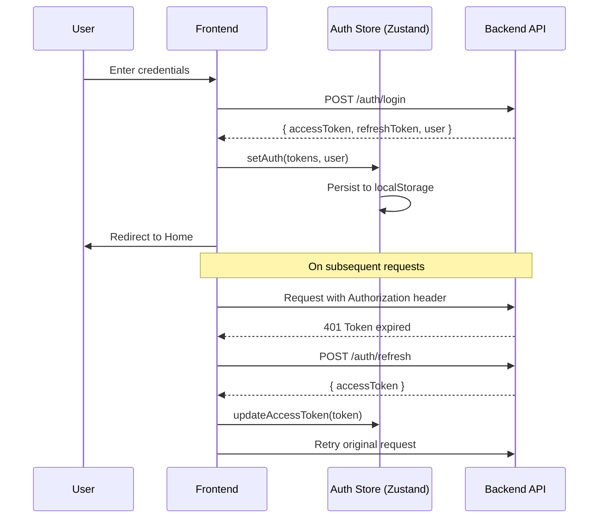
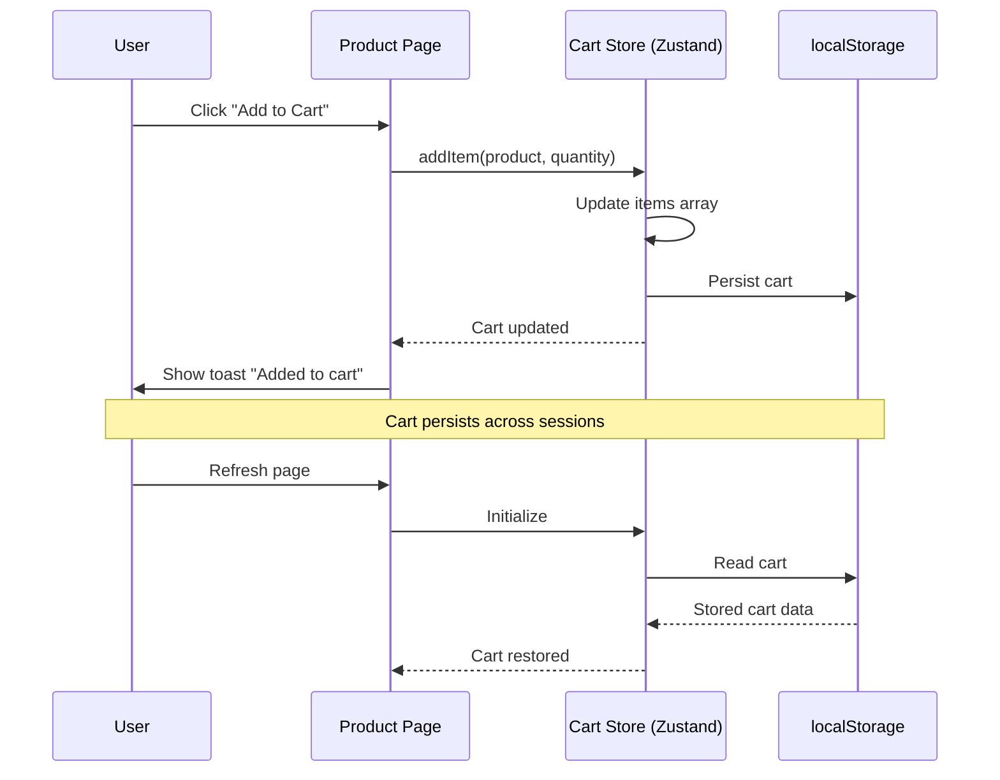
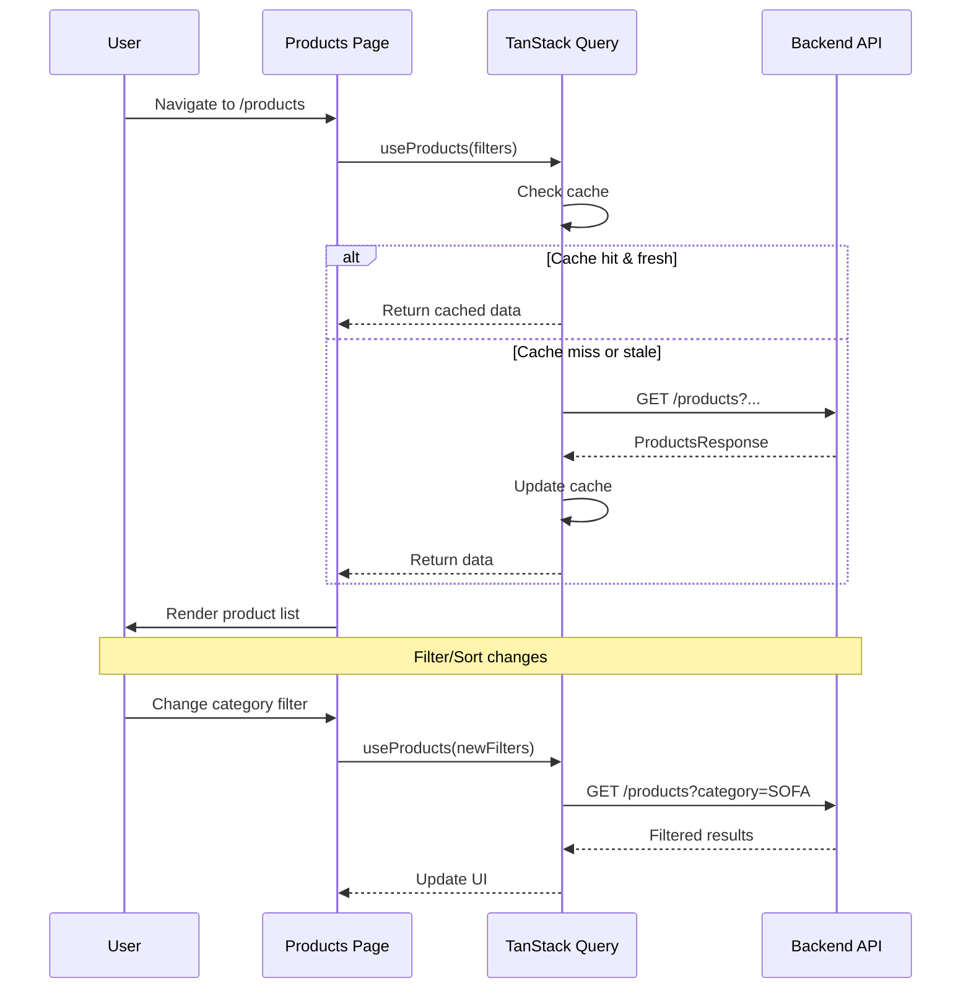
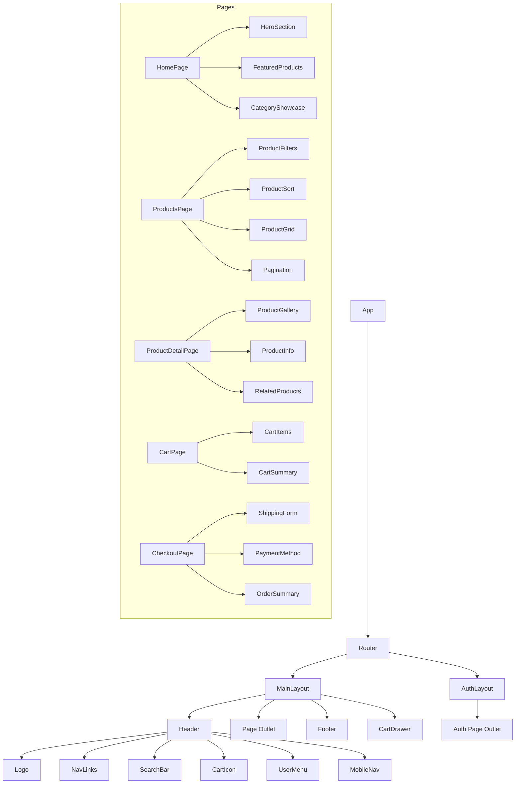

# System Design & Architecture

## Architecture Overview

**High-level system structure:**



### Key Components and Responsibilities

| Layer             | Component                                                               | Responsibility                              |
| ----------------- | ----------------------------------------------------------------------- | ------------------------------------------- |
| **Routing**       | React Router v7                                                         | URL → Page mapping, Guards, Lazy loading    |
| **Layouts**       | MainLayout, AuthLayout                                                  | Header, Footer, Navigation, Sidebar         |
| **Pages**         | Home, Products, ProductDetail, Cart, Checkout, Login, Register, Profile | Business logic, Data fetching               |
| **UI Components** | shadcn/ui + Custom                                                      | Reusable UI elements                        |
| **Server State**  | TanStack Query                                                          | API calls, Caching, Loading/Error states    |
| **Client State**  | Zustand                                                                 | Cart, Auth tokens, UI state                 |
| **API Layer**     | Axios                                                                   | HTTP requests, Interceptors, Error handling |

### Technology Stack Rationale

| Technology                | Why Chosen                                          | Alternatives Considered                           |
| ------------------------- | --------------------------------------------------- | ------------------------------------------------- |
| **Vite**                  | Fast HMR, ESM-based, Already setup                  | CRA (slow), Next.js (overkill for SPA)            |
| **React 19**              | Latest features, Already installed                  | -                                                 |
| **TypeScript**            | Type safety, Better DX                              | -                                                 |
| **TanStack Query**        | Best server state management, Caching, Auto refetch | SWR (less features), RTK Query (heavier)          |
| **Zustand**               | Simple, Small bundle, Persist middleware            | Jotai (atomic model not needed), Redux (overkill) |
| **React Router v7**       | Industry standard, New data APIs                    | TanStack Router (newer, less stable)              |
| **shadcn/ui**             | Customizable, Accessible, Copy-paste                | Chakra UI (heavier), MUI (opinionated)            |
| **Framer Motion**         | Best React animation library                        | React Spring (harder API)                         |
| **Axios**                 | Interceptors, Better API than fetch                 | fetch (no interceptors built-in)                  |
| **React Hook Form + Zod** | Performance, Type-safe validation                   | Formik (heavier)                                  |

## Data Models

**Frontend TypeScript interfaces (mapped from Backend DTOs):**

### Product Types

```typescript
// src/types/product.ts

export type ProductCategory =
  | "SOFA"
  | "TABLE"
  | "CHAIR"
  | "BED"
  | "CABINET"
  | "SHELF"
  | "LIGHTING"
  | "DECORATION";

export type ProductStatus = "ACTIVE" | "INACTIVE" | "OUT_OF_STOCK";

export interface Product {
  id: string;
  name: string;
  description: string;
  price: number;
  stock: number;
  status: ProductStatus;
  category: ProductCategory;
  material?: string;
  images?: string[];
  discountPercentage?: number;
  createdAt: string; // ISO date string
  updatedAt: string;
}

export interface ProductsQuery {
  page?: number;
  limit?: number;
  category?: ProductCategory;
  status?: ProductStatus;
  search?: string;
  sortBy?: "price" | "createdAt" | "name";
  sortOrder?: "asc" | "desc";
}

export interface ProductsResponse {
  data: Product[];
  total: number;
  page: number;
  limit: number;
  totalPages: number;
}
```

### User & Auth Types

```typescript
// src/types/user.ts

export type UserRole = "ADMIN" | "CUSTOMER" | "STAFF";
export type UserStatus = "ACTIVE" | "INACTIVE" | "BANNED";

export interface User {
  id: string;
  email: string;
  firstName: string;
  lastName: string;
  phone?: string;
  avatar?: string;
  address?: string;
  role: UserRole;
  status: UserStatus;
  lastLoginAt?: string;
  createdAt: string;
  updatedAt: string;
}

export interface CreateUserPayload {
  email: string;
  password: string;
  firstName: string;
  lastName: string;
  phone?: string;
  address?: string;
}

export interface UpdateUserPayload {
  firstName?: string;
  lastName?: string;
  phone?: string;
  avatar?: string;
  address?: string;
}
```

```typescript
// src/types/auth.ts

export interface LoginPayload {
  email: string;
  password: string;
}

export interface AuthResponse {
  accessToken: string;
  refreshToken: string;
  expiresIn: number;
  user: {
    id: string;
    email: string;
    firstName: string;
    lastName: string;
    role: string;
  };
}

export interface RefreshTokenPayload {
  refreshToken: string;
}

export interface RefreshTokenResponse {
  accessToken: string;
  expiresIn: number;
}
```

### Cart Types (Client-side only)

```typescript
// src/types/cart.ts

export interface CartItem {
  productId: string;
  product: Product;
  quantity: number;
  addedAt: string;
}

export interface Cart {
  items: CartItem[];
  updatedAt: string;
}

// Computed values
export interface CartSummary {
  itemCount: number;
  subtotal: number;
  discount: number;
  shipping: number;
  total: number;
}
```

### Order Types (Client-side mock)

```typescript
// src/types/order.ts

export interface ShippingInfo {
  fullName: string;
  phone: string;
  address: string;
  city: string;
  district: string;
  ward: string;
  note?: string;
}

export interface Order {
  id: string;
  items: CartItem[];
  shippingInfo: ShippingInfo;
  subtotal: number;
  shipping: number;
  discount: number;
  total: number;
  status: "pending" | "confirmed" | "shipped" | "delivered" | "cancelled";
  paymentMethod: "cod" | "bank_transfer";
  createdAt: string;
}
```

## Data Flow Diagrams

### Authentication Flow



### Cart Flow



### Product Listing with TanStack Query



## API Design

**Frontend API Client Structure:**

```typescript
// src/lib/api/index.ts - Axios instance với interceptors

// src/lib/api/products.ts
export const productsApi = {
  getAll: (params: ProductsQuery) =>
    api.get<ProductsResponse>("/products", { params }),
  getById: (id: string) => api.get<Product>(`/products/${id}`),
  create: (data: CreateProductPayload) => api.post<Product>("/products", data),
  update: (id: string, data: UpdateProductPayload) =>
    api.patch<Product>(`/products/${id}`, data),
  delete: (id: string) => api.delete(`/products/${id}`),
  updateStock: (id: string, stock: number) =>
    api.patch<Product>(`/products/${id}/stock`, { stock }),
};

// src/lib/api/auth.ts
export const authApi = {
  login: (data: LoginPayload) => api.post<AuthResponse>("/auth/login", data),
  refresh: (data: RefreshTokenPayload) =>
    api.post<RefreshTokenResponse>("/auth/refresh", data),
  logout: (refreshToken: string) => api.post("/auth/logout", { refreshToken }),
};

// src/lib/api/users.ts
export const usersApi = {
  getAll: (params: UsersQuery) => api.get<UsersResponse>("/users", { params }),
  getById: (id: string) => api.get<User>(`/users/${id}`),
  create: (data: CreateUserPayload) => api.post<User>("/users", data),
  update: (id: string, data: UpdateUserPayload) =>
    api.patch<User>(`/users/${id}`, data),
  delete: (id: string) => api.delete(`/users/${id}`),
};
```

### Axios Interceptors Design

```typescript
// Request interceptor
api.interceptors.request.use((config) => {
  const token = useAuthStore.getState().accessToken;
  if (token) {
    config.headers.Authorization = `Bearer ${token}`;
  }
  return config;
});

// Response interceptor with refresh token logic
api.interceptors.response.use(
  (response) => response,
  async (error) => {
    const originalRequest = error.config;

    if (error.response?.status === 401 && !originalRequest._retry) {
      originalRequest._retry = true;

      try {
        const refreshToken = useAuthStore.getState().refreshToken;
        const { data } = await authApi.refresh({ refreshToken });

        useAuthStore.getState().setAccessToken(data.accessToken);
        originalRequest.headers.Authorization = `Bearer ${data.accessToken}`;

        return api(originalRequest);
      } catch (refreshError) {
        useAuthStore.getState().logout();
        window.location.href = "/login";
        return Promise.reject(refreshError);
      }
    }

    return Promise.reject(error);
  },
);
```

## Component Breakdown

### Directory Structure

```
frontend/src/
├── components/
│   ├── ui/                     # shadcn/ui components
│   │   ├── button.tsx
│   │   ├── card.tsx
│   │   ├── input.tsx
│   │   ├── select.tsx
│   │   ├── sheet.tsx
│   │   ├── skeleton.tsx
│   │   ├── toast.tsx
│   │   ├── dropdown-menu.tsx
│   │   ├── dialog.tsx
│   │   ├── form.tsx
│   │   ├── label.tsx
│   │   ├── badge.tsx
│   │   ├── separator.tsx
│   │   ├── scroll-area.tsx
│   │   └── ...
│   ├── layout/                 # Layout components
│   │   ├── Header.tsx
│   │   ├── Footer.tsx
│   │   ├── MainLayout.tsx
│   │   ├── AuthLayout.tsx
│   │   ├── MobileNav.tsx
│   │   └── UserMenu.tsx
│   ├── products/               # Product-specific components
│   │   ├── ProductCard.tsx
│   │   ├── ProductGrid.tsx
│   │   ├── ProductFilters.tsx
│   │   ├── ProductSort.tsx
│   │   ├── ProductGallery.tsx
│   │   ├── ProductInfo.tsx
│   │   ├── RelatedProducts.tsx
│   │   └── CategoryNav.tsx
│   ├── cart/                   # Cart components
│   │   ├── CartDrawer.tsx
│   │   ├── CartItem.tsx
│   │   ├── CartSummary.tsx
│   │   └── CartEmpty.tsx
│   ├── checkout/               # Checkout components
│   │   ├── CheckoutForm.tsx
│   │   ├── ShippingForm.tsx
│   │   ├── PaymentMethod.tsx
│   │   └── OrderSummary.tsx
│   ├── auth/                   # Auth components
│   │   ├── LoginForm.tsx
│   │   ├── RegisterForm.tsx
│   │   └── ProtectedRoute.tsx
│   ├── home/                   # Homepage components
│   │   ├── HeroSection.tsx
│   │   ├── FeaturedProducts.tsx
│   │   ├── CategoryShowcase.tsx
│   │   └── WhyChooseUs.tsx
│   └── shared/                 # Shared components
│       ├── LoadingSpinner.tsx
│       ├── ErrorBoundary.tsx
│       ├── EmptyState.tsx
│       ├── Pagination.tsx
│       ├── SEO.tsx
│       └── LazyImage.tsx
├── pages/                      # Route pages
│   ├── HomePage.tsx
│   ├── ProductsPage.tsx
│   ├── ProductDetailPage.tsx
│   ├── CartPage.tsx
│   ├── CheckoutPage.tsx
│   ├── OrderConfirmationPage.tsx
│   ├── LoginPage.tsx
│   ├── RegisterPage.tsx
│   ├── ProfilePage.tsx
│   └── NotFoundPage.tsx
├── hooks/                      # Custom hooks
│   ├── useProducts.ts          # TanStack Query hooks
│   ├── useProduct.ts
│   ├── useAuth.ts
│   ├── useUser.ts
│   ├── useCart.ts              # Cart store hook
│   ├── useDebounce.ts
│   └── useMediaQuery.ts
├── stores/                     # Zustand stores
│   ├── authStore.ts
│   ├── cartStore.ts
│   └── uiStore.ts
├── lib/                        # Utilities
│   ├── api/
│   │   ├── index.ts            # Axios instance
│   │   ├── products.ts
│   │   ├── auth.ts
│   │   └── users.ts
│   ├── utils.ts                # shadcn utils
│   ├── constants.ts
│   └── formatters.ts           # Price, date formatters
├── types/                      # TypeScript types
│   ├── product.ts
│   ├── user.ts
│   ├── auth.ts
│   ├── cart.ts
│   └── order.ts
├── routes/                     # Router configuration
│   └── index.tsx
├── App.tsx
├── main.tsx
└── index.css
```

### Component Hierarchy



## Design Decisions

### Decision 1: TanStack Query vs SWR

**Chosen:** TanStack Query v5

**Rationale:**

- Richer feature set (mutations, infinite queries, prefetching)
- Better devtools
- More active community
- Optimistic updates built-in

**Trade-offs:**

- Slightly larger bundle size (~12KB vs ~4KB)
- More concepts to learn

### Decision 2: Zustand vs Jotai vs Context

**Chosen:** Zustand

**Rationale:**

- Simple API, minimal boilerplate
- Built-in persist middleware for localStorage
- Works outside React components (useful for Axios interceptors)
- Small bundle (~1KB)

**Trade-offs:**

- Less granular than Jotai for complex state
- Single store pattern vs atomic

### Decision 3: Cart Drawer vs Cart Page

**Chosen:** Both (Drawer for quick view, Page for full management)

**Rationale:**

- Drawer: Quick add/view without leaving current page
- Page: Full cart management, better UX on mobile

### Decision 4: Form Library

**Chosen:** React Hook Form + Zod

**Rationale:**

- Uncontrolled inputs = better performance
- Zod for type-safe validation
- shadcn/ui Form component built on this

### Decision 5: Image Loading Strategy

**Chosen:** Native lazy loading + Skeleton placeholders

**Rationale:**

- `loading="lazy"` has good browser support
- Skeleton provides better UX than spinners
- No external library needed

## Non-Functional Requirements

### Performance Targets

| Metric                   | Target  | Measurement  |
| ------------------------ | ------- | ------------ |
| First Contentful Paint   | < 1.5s  | Lighthouse   |
| Largest Contentful Paint | < 2.5s  | Lighthouse   |
| Time to Interactive      | < 3.5s  | Lighthouse   |
| Cumulative Layout Shift  | < 0.1   | Lighthouse   |
| Bundle Size (gzipped)    | < 300KB | `vite build` |

**Optimization Strategies:**

- Route-based code splitting with `React.lazy()`
- Image lazy loading
- TanStack Query caching (staleTime: 5 minutes)
- Debounced search input

### Scalability Considerations

- **Component Library:** shadcn/ui allows easy customization and extension
- **State Management:** Zustand stores can be split as app grows
- **API Layer:** Centralized API client makes adding endpoints easy
- **Types:** Shared types in `/types` folder, can extract to shared package

### Security Requirements

- **Token Storage:**
  - Access token: Memory (Zustand store, not persisted)
  - Refresh token: localStorage (with expiry check)
- **XSS Prevention:** React escapes by default, no `dangerouslySetInnerHTML`
- **CSRF:** Not applicable (REST API with JWT, no cookies)
- **Input Validation:** Zod schemas on all forms

### Accessibility (a11y)

- shadcn/ui components are WCAG 2.1 AA compliant
- Keyboard navigation for all interactive elements
- ARIA labels for icons and images
- Focus management for modals and drawers
- Color contrast ratio ≥ 4.5:1

### Browser Support

| Browser       | Version         |
| ------------- | --------------- |
| Chrome        | Last 2 versions |
| Firefox       | Last 2 versions |
| Safari        | Last 2 versions |
| Edge          | Last 2 versions |
| Mobile Safari | iOS 14+         |
| Chrome Mobile | Android 10+     |

## UI/UX Design Specifications

### Color Palette (Stone Theme)

```css
/* shadcn Stone theme - Already configured */
--background: 0 0% 100%;
--foreground: 20 14.3% 4.1%;
--card: 0 0% 100%;
--card-foreground: 20 14.3% 4.1%;
--primary: 24 9.8% 10%;
--primary-foreground: 60 9.1% 97.8%;
--secondary: 60 4.8% 95.9%;
--secondary-foreground: 24 9.8% 10%;
--muted: 60 4.8% 95.9%;
--muted-foreground: 25 5.3% 44.7%;
--accent: 60 4.8% 95.9%;
--accent-foreground: 24 9.8% 10%;
--destructive: 0 84.2% 60.2%;
--border: 20 5.9% 90%;
--ring: 20 14.3% 4.1%;
```

### Typography

```css
/* Font: System font stack (already configured) */
font-family: ui-sans-serif, system-ui, sans-serif;

/* Scale */
--text-xs: 0.75rem; /* 12px */
--text-sm: 0.875rem; /* 14px */
--text-base: 1rem; /* 16px */
--text-lg: 1.125rem; /* 18px */
--text-xl: 1.25rem; /* 20px */
--text-2xl: 1.5rem; /* 24px */
--text-3xl: 1.875rem; /* 30px */
--text-4xl: 2.25rem; /* 36px */
```

### Spacing & Layout

```css
/* Container max-widths */
--container-sm: 640px;
--container-md: 768px;
--container-lg: 1024px;
--container-xl: 1280px;
--container-2xl: 1400px;

/* Grid */
--grid-cols-products: repeat(auto-fill, minmax(280px, 1fr));
```

### Animation Guidelines

```typescript
// Framer Motion variants
const fadeIn = {
  initial: { opacity: 0 },
  animate: { opacity: 1 },
  transition: { duration: 0.3 },
};

const slideUp = {
  initial: { opacity: 0, y: 20 },
  animate: { opacity: 1, y: 0 },
  transition: { duration: 0.4, ease: "easeOut" },
};

const staggerContainer = {
  animate: { transition: { staggerChildren: 0.1 } },
};
```

### Responsive Breakpoints

```css
/* Tailwind defaults */
sm: 640px   /* Mobile landscape */
md: 768px   /* Tablet */
lg: 1024px  /* Desktop */
xl: 1280px  /* Large desktop */
2xl: 1536px /* Extra large */
```
