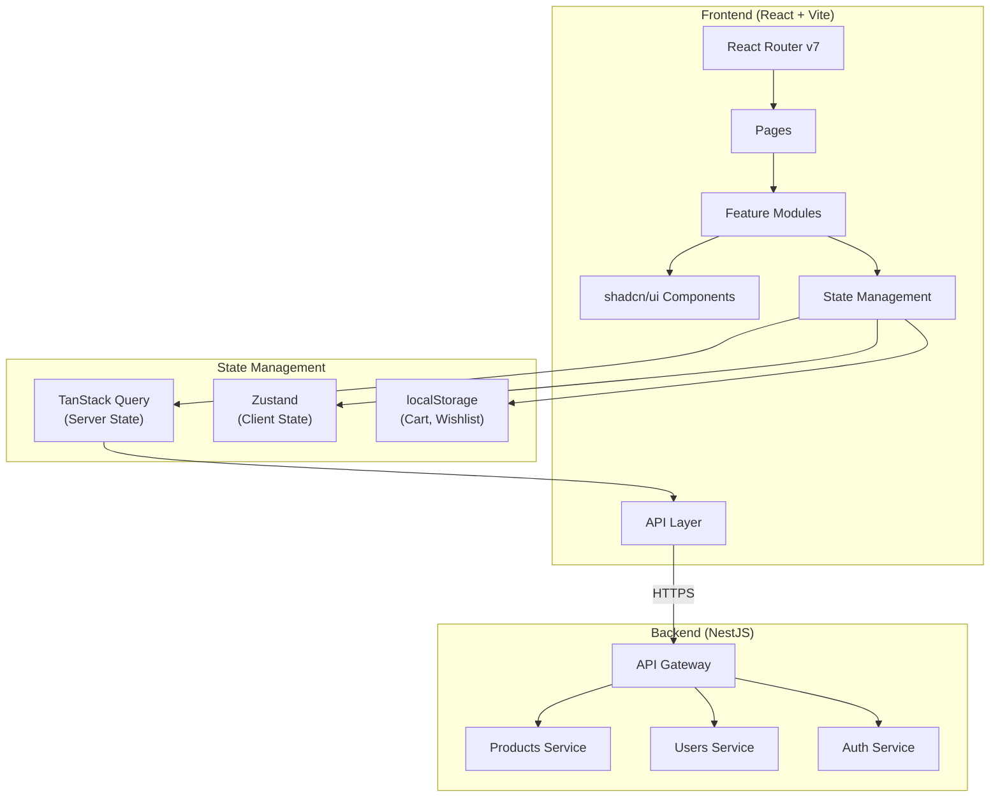

# System Design & Architecture

## Architecture Overview

**What is the high-level system structure?**



### Key Components

| Component       | Responsibility                          |
| --------------- | --------------------------------------- |
| React Router v7 | Client-side routing, route guards       |
| TanStack Query  | Server state, caching, API calls        |
| Zustand         | Client state (auth, UI state)           |
| localStorage    | Persistent client data (cart, wishlist) |
| shadcn/ui       | UI component library                    |
| Framer Motion   | Animations                              |

### Technology Stack Rationale

#### State Management Decision: TanStack Query + Zustand

**Option A: TanStack Query + Zustand** ✅ RECOMMENDED

- TanStack Query: Server state (products, users) - caching, refetching, optimistic updates
- Zustand: Client state (auth, cart, UI) - simple, lightweight, no boilerplate

**Option B: TanStack Query + Jotai**

- Jotai: Atomic state management, bottom-up approach
- Phù hợp cho apps phức tạp với nhiều derived state

**Option C: Zustand only**

- Đơn giản nhưng phải tự handle caching, refetching

**Recommendation**: Option A - TanStack Query cho server state (products, users API) + Zustand cho client state (auth session, cart, UI preferences).

## Data Models

**What data do we need to manage?**

### Product Types

```typescript
// Enums
enum ProductCategory {
  SOFA = "SOFA",
  TABLE = "TABLE",
  CHAIR = "CHAIR",
  BED = "BED",
  CABINET = "CABINET",
  SHELF = "SHELF",
  LIGHTING = "LIGHTING",
  DECORATION = "DECORATION",
}

enum ProductStatus {
  ACTIVE = "ACTIVE",
  INACTIVE = "INACTIVE",
  OUT_OF_STOCK = "OUT_OF_STOCK",
}

// Product entity
interface Product {
  id: string;
  name: string;
  description: string;
  price: number;
  stock: number;
  category: ProductCategory;
  status: ProductStatus;
  material?: string;
  images?: string[];
  discountPercentage?: number;
  createdAt: Date;
  updatedAt: Date;
}

// Paginated response
interface ProductsResponse {
  data: Product[];
  total: number;
  page: number;
  limit: number;
  totalPages: number;
}

// Query params
interface ProductsQuery {
  page?: number;
  limit?: number;
  category?: ProductCategory;
  status?: ProductStatus;
  search?: string;
  sortBy?: "price" | "createdAt" | "name";
  sortOrder?: "asc" | "desc";
}
```

### User Types

```typescript
enum UserRole {
  ADMIN = "ADMIN",
  CUSTOMER = "CUSTOMER",
  STAFF = "STAFF",
}

enum UserStatus {
  ACTIVE = "ACTIVE",
  INACTIVE = "INACTIVE",
  BANNED = "BANNED",
}

interface User {
  id: string;
  email: string;
  firstName: string;
  lastName: string;
  phone?: string;
  avatar?: string;
  address?: string;
  role: UserRole;
  status: UserStatus;
  lastLoginAt?: Date;
  createdAt: Date;
  updatedAt: Date;
}

interface CreateUserDto {
  email: string;
  password: string;
  firstName: string;
  lastName: string;
  phone?: string;
  avatar?: string;
  address?: string;
}

interface UpdateUserDto {
  firstName?: string;
  lastName?: string;
  phone?: string;
  avatar?: string;
  address?: string;
}
```

### Auth Types

```typescript
interface LoginDto {
  email: string;
  password: string;
}

interface AuthResponse {
  accessToken: string;
  refreshToken: string;
  expiresIn: number;
  user: {
    id: string;
    email: string;
    firstName: string;
    lastName: string;
    role: string;
  };
}

interface RefreshTokenDto {
  refreshToken: string;
}
```

### Client-Side Types (localStorage)

```typescript
// Cart
interface CartItem {
  productId: string;
  product: Product;
  quantity: number;
}

interface Cart {
  items: CartItem[];
  updatedAt: Date;
}

// Wishlist
interface Wishlist {
  productIds: string[];
  updatedAt: Date;
}
```

## API Design

**How do components communicate?**

### API Client Architecture

```typescript
// Base API client with interceptors
const apiClient = axios.create({
  baseURL: import.meta.env.VITE_API_URL,
  timeout: 10000,
});

// Request interceptor: Add auth token
apiClient.interceptors.request.use((config) => {
  const token = useAuthStore.getState().accessToken;
  if (token) {
    config.headers.Authorization = `Bearer ${token}`;
  }
  return config;
});

// Response interceptor: Handle 401, refresh token
apiClient.interceptors.response.use(
  (response) => response,
  async (error) => {
    if (error.response?.status === 401) {
      // Try refresh token
      // If failed, logout
    }
    return Promise.reject(error);
  },
);
```

### API Modules Structure

```
src/
  api/
    client.ts          # Axios instance, interceptors
    products.api.ts    # Products endpoints
    auth.api.ts        # Auth endpoints
    users.api.ts       # Users endpoints
```

## Component Breakdown

**What are the major building blocks?**

### Folder Structure (Feature-Based)

```
src/
├── api/                      # API layer
│   ├── client.ts
│   ├── products.api.ts
│   ├── auth.api.ts
│   └── users.api.ts
├── components/               # Shared components
│   ├── ui/                   # shadcn/ui components
│   ├── layout/               # Layout components
│   │   ├── Header.tsx
│   │   ├── Footer.tsx
│   │   ├── Navigation.tsx
│   │   └── Layout.tsx
│   └── common/               # Common reusable components
│       ├── ProductCard.tsx
│       ├── LoadingSpinner.tsx
│       ├── ErrorBoundary.tsx
│       └── SEOHead.tsx
├── features/                 # Feature modules
│   ├── home/
│   │   ├── components/
│   │   ├── hooks/
│   │   └── HomePage.tsx
│   ├── products/
│   │   ├── components/
│   │   │   ├── ProductGrid.tsx
│   │   │   ├── ProductFilters.tsx
│   │   │   ├── ProductSort.tsx
│   │   │   └── ProductDetail.tsx
│   │   ├── hooks/
│   │   │   ├── useProducts.ts
│   │   │   └── useProduct.ts
│   │   ├── ProductsPage.tsx
│   │   └── ProductDetailPage.tsx
│   ├── cart/
│   │   ├── components/
│   │   ├── hooks/
│   │   │   └── useCart.ts
│   │   ├── store/
│   │   │   └── cart.store.ts
│   │   └── CartPage.tsx
│   ├── checkout/
│   │   ├── components/
│   │   └── CheckoutPage.tsx
│   ├── auth/
│   │   ├── components/
│   │   ├── hooks/
│   │   │   └── useAuth.ts
│   │   ├── store/
│   │   │   └── auth.store.ts
│   │   ├── LoginPage.tsx
│   │   └── RegisterPage.tsx
│   └── profile/
│       ├── components/
│       ├── hooks/
│       └── ProfilePage.tsx
├── hooks/                    # Global hooks
│   └── useLocalStorage.ts
├── lib/                      # Utilities
│   ├── utils.ts              # shadcn utils
│   └── constants.ts
├── types/                    # Global types
│   ├── product.types.ts
│   ├── user.types.ts
│   └── auth.types.ts
├── routes/                   # Route configuration
│   ├── index.tsx
│   └── ProtectedRoute.tsx
├── App.tsx
├── main.tsx
└── index.css
```

### Pages Overview

| Page           | Route           | Components                                   | API Calls                        |
| -------------- | --------------- | -------------------------------------------- | -------------------------------- |
| Home           | `/`             | Hero, FeaturedProducts, Categories           | GET /products (featured)         |
| Products       | `/products`     | ProductGrid, Filters, Sort, Pagination       | GET /products                    |
| Product Detail | `/products/:id` | ProductGallery, ProductInfo, RelatedProducts | GET /products/:id                |
| Cart           | `/cart`         | CartItems, CartSummary                       | None (localStorage)              |
| Checkout       | `/checkout`     | CheckoutForm, OrderSummary                   | None (simulated)                 |
| Login          | `/login`        | LoginForm                                    | POST /auth/login                 |
| Register       | `/register`     | RegisterForm                                 | POST /users                      |
| Profile        | `/profile`      | ProfileForm, ProfileInfo                     | GET /users/:id, PATCH /users/:id |

## Design Decisions

**Why did we choose this approach?**

### 1. Feature-Based Architecture

**Decision**: Tổ chức code theo feature thay vì type (components, pages, hooks)
**Rationale**:

- Dễ scale khi thêm feature mới
- Mỗi feature tự chứa (self-contained)
- Dễ tìm code liên quan

### 2. TanStack Query cho Server State

**Decision**: Dùng TanStack Query thay vì fetch trong useEffect
**Rationale**:

- Automatic caching và background refetching
- Loading/error states built-in
- Optimistic updates cho UX tốt hơn
- Devtools để debug

### 3. Zustand cho Client State

**Decision**: Dùng Zustand thay vì Context hoặc Redux
**Rationale**:

- Không cần Provider wrapper
- API đơn giản, ít boilerplate
- Persist middleware cho localStorage
- TypeScript support tốt

### 4. localStorage cho Cart/Wishlist

**Decision**: Lưu cart và wishlist ở client
**Rationale**:

- Backend không có cart API
- Trải nghiệm offline tốt hơn
- Đơn giản hóa backend

### 5. shadcn/ui với Neutral color

**Decision**: Dùng base color Neutral
**Rationale**:

- Tone nhẹ nhàng, trung tính, hiện đại
- Phù hợp với furniture aesthetic
- Dễ customize

## Non-Functional Requirements

**How should the system perform?**

### Performance

- Bundle size < 500KB gzipped
- Lazy loading cho routes
- Image optimization (lazy load, responsive)
- Memoization cho expensive renders

### Security

- JWT tokens stored in memory (access) + httpOnly cookie or localStorage (refresh)
- XSS prevention (React handles by default)
- Input validation (client + server)

### Reliability

- Error boundaries cho crash protection
- Retry logic cho API calls (TanStack Query)
- Offline indication

### Accessibility

- Semantic HTML
- ARIA labels
- Keyboard navigation
- Color contrast (WCAG AA)

## UI/UX Design Guidelines

### Color Palette (Neutral)

- Background: `hsl(0 0% 100%)` / `hsl(0 0% 98%)`
- Foreground: `hsl(0 0% 9%)` / `hsl(0 0% 15%)`
- Primary: `hsl(0 0% 9%)` (dark neutral)
- Accent: Warm wood tones for CTAs

### Typography

- Font: System fonts hoặc Inter/Plus Jakarta Sans
- Hierarchy: Clear size differentiation
- Line height: 1.5-1.7 for readability

### Spacing

- Grid: 8px base unit
- Container: max-width 1280px
- Section padding: 64px-80px vertical

### Animation (Framer Motion)

- Page transitions: fade + slight slide
- Hover effects: subtle scale/shadow
- Loading states: skeleton loaders
- Duration: 200-300ms
