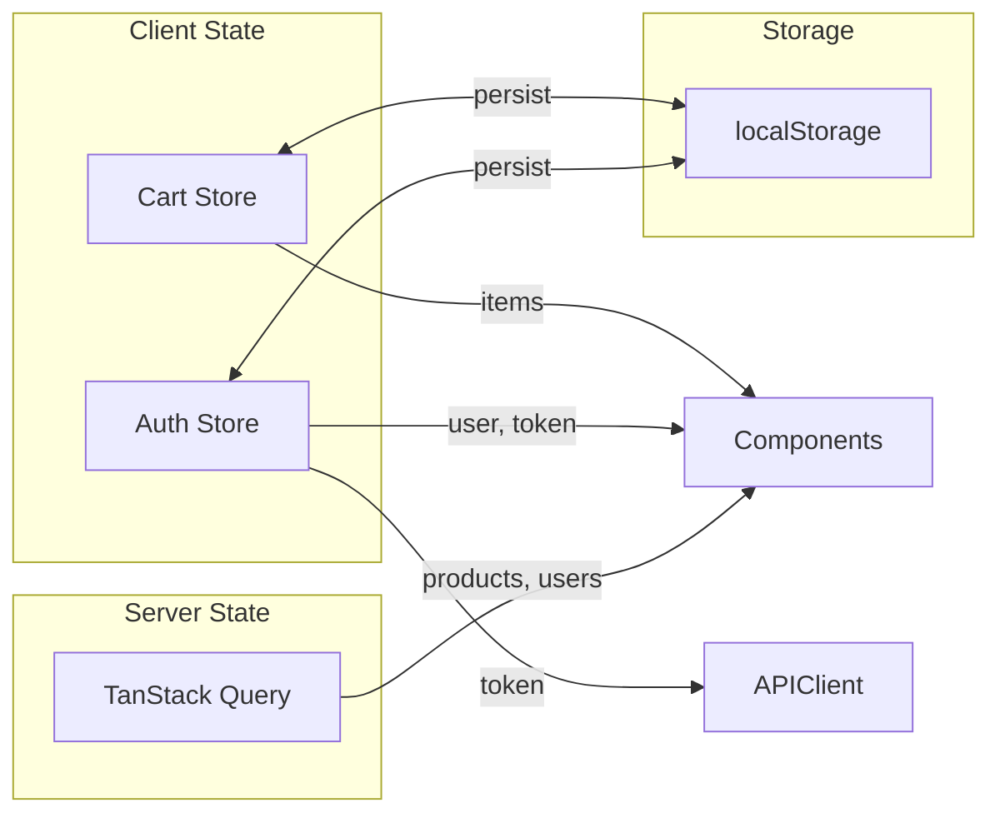

# Implementation Guide

## Development Setup

**How do we get started?**

### Prerequisites

- Node.js 20+
- pnpm (package manager)
- Backend API running on localhost:3000

### Environment Setup

```bash
cd frontend

# Install new dependencies
pnpm add react-router @tanstack/react-query zustand framer-motion axios zod react-hook-form @hookform/resolvers

# Install shadcn/ui components
pnpm dlx shadcn@latest add button card input label textarea select checkbox radio-group switch sheet dialog dropdown-menu popover avatar badge separator skeleton toast sonner form table tabs carousel accordion scroll-area aspect-ratio
```

### Configuration

```env
# .env
VITE_API_URL=http://localhost:3000
VITE_APP_NAME=Nội Thất Việt
```

## Code Structure

**How is the code organized?**

### Directory Structure

```
src/
├── api/                      # API layer
│   ├── client.ts             # Axios instance
│   ├── products.api.ts
│   ├── auth.api.ts
│   └── users.api.ts
├── components/
│   ├── ui/                   # shadcn/ui (auto-generated)
│   ├── layout/
│   │   ├── Header.tsx
│   │   ├── Footer.tsx
│   │   ├── Navigation.tsx
│   │   └── RootLayout.tsx
│   └── common/
│       ├── ProductCard.tsx
│       ├── LoadingSpinner.tsx
│       ├── ErrorBoundary.tsx
│       ├── EmptyState.tsx
│       └── Pagination.tsx
├── features/
│   ├── home/
│   │   ├── components/
│   │   │   ├── HeroSection.tsx
│   │   │   ├── FeaturedProducts.tsx
│   │   │   ├── CategoryShowcase.tsx
│   │   │   └── BenefitsSection.tsx
│   │   └── HomePage.tsx
│   ├── products/
│   │   ├── components/
│   │   │   ├── ProductGrid.tsx
│   │   │   ├── ProductFilters.tsx
│   │   │   ├── ProductSort.tsx
│   │   │   ├── ProductGallery.tsx
│   │   │   └── ProductInfo.tsx
│   │   ├── hooks/
│   │   │   ├── useProducts.ts
│   │   │   └── useProduct.ts
│   │   ├── ProductsPage.tsx
│   │   └── ProductDetailPage.tsx
│   ├── cart/
│   │   ├── components/
│   │   │   ├── CartItem.tsx
│   │   │   └── CartSummary.tsx
│   │   ├── hooks/
│   │   │   └── useCart.ts
│   │   ├── store/
│   │   │   └── cart.store.ts
│   │   └── CartPage.tsx
│   ├── checkout/
│   │   ├── components/
│   │   │   ├── ShippingForm.tsx
│   │   │   ├── PaymentForm.tsx
│   │   │   └── OrderSummary.tsx
│   │   ├── CheckoutPage.tsx
│   │   └── OrderConfirmationPage.tsx
│   ├── auth/
│   │   ├── components/
│   │   │   ├── LoginForm.tsx
│   │   │   └── RegisterForm.tsx
│   │   ├── hooks/
│   │   │   └── useAuth.ts
│   │   ├── store/
│   │   │   └── auth.store.ts
│   │   ├── LoginPage.tsx
│   │   └── RegisterPage.tsx
│   └── profile/
│       ├── components/
│       │   └── ProfileForm.tsx
│       ├── hooks/
│       │   └── useProfile.ts
│       └── ProfilePage.tsx
├── hooks/
│   └── useLocalStorage.ts
├── lib/
│   ├── utils.ts
│   └── constants.ts
├── types/
│   ├── product.types.ts
│   ├── user.types.ts
│   ├── auth.types.ts
│   └── cart.types.ts
├── routes/
│   ├── index.tsx
│   └── ProtectedRoute.tsx
├── App.tsx
├── main.tsx
└── index.css
```

### Naming Conventions

- **Files**: kebab-case cho utilities, PascalCase cho components
- **Components**: PascalCase (ProductCard.tsx)
- **Hooks**: camelCase với prefix `use` (useProducts.ts)
- **Stores**: camelCase với suffix `.store.ts`
- **Types**: PascalCase với suffix Type/Dto/Response

## Implementation Notes

**Key technical details to remember:**

### API Client Setup

```typescript
// src/api/client.ts
import axios from "axios";
import { useAuthStore } from "@/features/auth/store/auth.store";

const API_URL = import.meta.env.VITE_API_URL || "http://localhost:3000";

export const apiClient = axios.create({
  baseURL: API_URL,
  timeout: 10000,
  headers: {
    "Content-Type": "application/json",
  },
});

// Request interceptor
apiClient.interceptors.request.use(
  (config) => {
    const token = useAuthStore.getState().accessToken;
    if (token) {
      config.headers.Authorization = `Bearer ${token}`;
    }
    return config;
  },
  (error) => Promise.reject(error),
);

// Response interceptor
apiClient.interceptors.response.use(
  (response) => response,
  async (error) => {
    const originalRequest = error.config;

    if (error.response?.status === 401 && !originalRequest._retry) {
      originalRequest._retry = true;

      try {
        const refreshToken = useAuthStore.getState().refreshToken;
        if (refreshToken) {
          const response = await axios.post(`${API_URL}/auth/refresh`, {
            refreshToken,
          });

          useAuthStore
            .getState()
            .setTokens(response.data.accessToken, refreshToken);

          originalRequest.headers.Authorization = `Bearer ${response.data.accessToken}`;
          return apiClient(originalRequest);
        }
      } catch (refreshError) {
        useAuthStore.getState().logout();
        window.location.href = "/login";
      }
    }

    return Promise.reject(error);
  },
);
```

### Auth Store (Zustand)

```typescript
// src/features/auth/store/auth.store.ts
import { create } from "zustand";
import { persist } from "zustand/middleware";

interface AuthUser {
  id: string;
  email: string;
  firstName: string;
  lastName: string;
  role: string;
}

interface AuthState {
  user: AuthUser | null;
  accessToken: string | null;
  refreshToken: string | null;
  isAuthenticated: boolean;

  setAuth: (user: AuthUser, accessToken: string, refreshToken: string) => void;
  setTokens: (accessToken: string, refreshToken: string) => void;
  logout: () => void;
}

export const useAuthStore = create<AuthState>()(
  persist(
    (set) => ({
      user: null,
      accessToken: null,
      refreshToken: null,
      isAuthenticated: false,

      setAuth: (user, accessToken, refreshToken) =>
        set({ user, accessToken, refreshToken, isAuthenticated: true }),

      setTokens: (accessToken, refreshToken) =>
        set({ accessToken, refreshToken }),

      logout: () =>
        set({
          user: null,
          accessToken: null,
          refreshToken: null,
          isAuthenticated: false,
        }),
    }),
    {
      name: "auth-storage",
      partialize: (state) => ({
        user: state.user,
        accessToken: state.accessToken,
        refreshToken: state.refreshToken,
        isAuthenticated: state.isAuthenticated,
      }),
    },
  ),
);
```

### Cart Store (Zustand + Persist)

```typescript
// src/features/cart/store/cart.store.ts
import { create } from "zustand";
import { persist } from "zustand/middleware";
import type { Product } from "@/types/product.types";

interface CartItem {
  product: Product;
  quantity: number;
}

interface CartState {
  items: CartItem[];

  addItem: (product: Product, quantity?: number) => void;
  removeItem: (productId: string) => void;
  updateQuantity: (productId: string, quantity: number) => void;
  clearCart: () => void;

  // Computed
  totalItems: () => number;
  totalPrice: () => number;
}

export const useCartStore = create<CartState>()(
  persist(
    (set, get) => ({
      items: [],

      addItem: (product, quantity = 1) => {
        const items = get().items;
        const existing = items.find((i) => i.product.id === product.id);

        if (existing) {
          set({
            items: items.map((i) =>
              i.product.id === product.id
                ? { ...i, quantity: i.quantity + quantity }
                : i,
            ),
          });
        } else {
          set({ items: [...items, { product, quantity }] });
        }
      },

      removeItem: (productId) => {
        set({ items: get().items.filter((i) => i.product.id !== productId) });
      },

      updateQuantity: (productId, quantity) => {
        if (quantity <= 0) {
          get().removeItem(productId);
          return;
        }
        set({
          items: get().items.map((i) =>
            i.product.id === productId ? { ...i, quantity } : i,
          ),
        });
      },

      clearCart: () => set({ items: [] }),

      totalItems: () => get().items.reduce((sum, i) => sum + i.quantity, 0),

      totalPrice: () =>
        get().items.reduce((sum, i) => {
          const price = i.product.discountPercentage
            ? i.product.price * (1 - i.product.discountPercentage / 100)
            : i.product.price;
          return sum + price * i.quantity;
        }, 0),
    }),
    {
      name: "cart-storage",
    },
  ),
);
```

### TanStack Query Setup

```typescript
// src/main.tsx
import { QueryClient, QueryClientProvider } from "@tanstack/react-query";
import { ReactQueryDevtools } from "@tanstack/react-query-devtools";

const queryClient = new QueryClient({
  defaultOptions: {
    queries: {
      staleTime: 5 * 60 * 1000, // 5 minutes
      retry: 1,
      refetchOnWindowFocus: false,
    },
  },
});

createRoot(document.getElementById("root")!).render(
  <StrictMode>
    <QueryClientProvider client={queryClient}>
      <App />
      <ReactQueryDevtools initialIsOpen={false} />
    </QueryClientProvider>
  </StrictMode>,
);
```

### Products Hook with TanStack Query

```typescript
// src/features/products/hooks/useProducts.ts
import { useQuery } from "@tanstack/react-query";
import { productsApi } from "@/api/products.api";
import type { ProductsQuery } from "@/types/product.types";

export function useProducts(query: ProductsQuery = {}) {
  return useQuery({
    queryKey: ["products", query],
    queryFn: () => productsApi.getProducts(query),
  });
}

export function useProduct(id: string) {
  return useQuery({
    queryKey: ["product", id],
    queryFn: () => productsApi.getProduct(id),
    enabled: !!id,
  });
}
```

### Routing Setup (React Router v7)

```typescript
// src/routes/index.tsx
import { createBrowserRouter, RouterProvider } from "react-router";
import { RootLayout } from "@/components/layout/RootLayout";
import { ProtectedRoute } from "./ProtectedRoute";

// Lazy load pages
const HomePage = lazy(() => import("@/features/home/HomePage"));
const ProductsPage = lazy(() => import("@/features/products/ProductsPage"));
const ProductDetailPage = lazy(
  () => import("@/features/products/ProductDetailPage"),
);
const CartPage = lazy(() => import("@/features/cart/CartPage"));
const CheckoutPage = lazy(() => import("@/features/checkout/CheckoutPage"));
const LoginPage = lazy(() => import("@/features/auth/LoginPage"));
const RegisterPage = lazy(() => import("@/features/auth/RegisterPage"));
const ProfilePage = lazy(() => import("@/features/profile/ProfilePage"));

const router = createBrowserRouter([
  {
    path: "/",
    element: <RootLayout />,
    children: [
      { index: true, element: <HomePage /> },
      { path: "products", element: <ProductsPage /> },
      { path: "products/:id", element: <ProductDetailPage /> },
      { path: "cart", element: <CartPage /> },
      { path: "login", element: <LoginPage /> },
      { path: "register", element: <RegisterPage /> },
      {
        path: "checkout",
        element: (
          <ProtectedRoute>
            <CheckoutPage />
          </ProtectedRoute>
        ),
      },
      {
        path: "profile",
        element: (
          <ProtectedRoute>
            <ProfilePage />
          </ProtectedRoute>
        ),
      },
    ],
  },
]);

export function AppRouter() {
  return <RouterProvider router={router} />;
}
```

## Integration Points

**How do pieces connect?**

### API Integration

| Feature        | API Endpoint      | Hook/Function               |
| -------------- | ----------------- | --------------------------- |
| Products list  | GET /products     | useProducts()               |
| Product detail | GET /products/:id | useProduct(id)              |
| Login          | POST /auth/login  | useLogin() mutation         |
| Logout         | POST /auth/logout | useLogout() mutation        |
| Register       | POST /users       | useRegister() mutation      |
| Profile        | GET /users/:id    | useProfile(id)              |
| Update profile | PATCH /users/:id  | useUpdateProfile() mutation |

### State Connections



## Error Handling

**How do we handle failures?**

### API Error Handling

```typescript
// Centralized error handler
export function handleApiError(error: unknown): string {
  if (axios.isAxiosError(error)) {
    const message = error.response?.data?.message;
    if (typeof message === "string") return message;
    if (Array.isArray(message)) return message.join(", ");

    switch (error.response?.status) {
      case 400:
        return "Dữ liệu không hợp lệ";
      case 401:
        return "Vui lòng đăng nhập";
      case 403:
        return "Không có quyền truy cập";
      case 404:
        return "Không tìm thấy";
      case 500:
        return "Lỗi server";
      default:
        return "Có lỗi xảy ra";
    }
  }
  return "Có lỗi xảy ra";
}
```

### Error Boundary

```typescript
// Wrap app với ErrorBoundary
<ErrorBoundary fallback={<ErrorPage />}>
  <App />
</ErrorBoundary>
```

### Toast Notifications

```typescript
// Dùng sonner cho notifications
import { toast } from "sonner";

// Success
toast.success("Đã thêm vào giỏ hàng");

// Error
toast.error("Có lỗi xảy ra");

// Loading
toast.promise(promise, {
  loading: "Đang xử lý...",
  success: "Thành công!",
  error: "Thất bại!",
});
```

## Performance Considerations

**How do we keep it fast?**

### Code Splitting

- Lazy load routes với React.lazy
- Dynamic imports cho heavy components

### Image Optimization

```typescript
// Lazy load images


// Responsive images

```

### Memoization

```typescript
// Memoize expensive components
const ProductCard = memo(function ProductCard({ product }: Props) {
  // ...
});

// Memoize callbacks
const handleAddToCart = useCallback(() => {
  addItem(product);
}, [addItem, product]);
```

## Security Notes

**What security measures are in place?**

### Token Storage

- Access token: Zustand store (memory) + localStorage (persist)
- Refresh token: localStorage (auto refresh trên 401)

### Input Validation

- Client: Zod schema validation
- Server: Backend handles validation

### XSS Prevention

- React auto-escapes by default
- Không dùng dangerouslySetInnerHTML với user input
