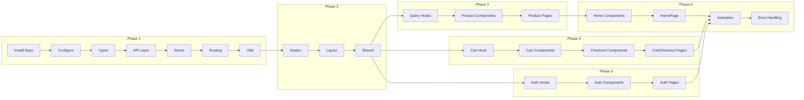

# Project Planning & Task Breakdown

## Milestones

| #   | Milestone          | Description                          | Deliverables                                            | Est. Hours |
| --- | ------------------ | ------------------------------------ | ------------------------------------------------------- | ---------- |
| M1  | Foundation Setup   | Dependencies, Config, Base structure | Routing, API client, Stores, Types                      | 4h         |
| M2  | Core UI Components | Layout, shadcn components            | Header, Footer, MainLayout, All UI components           | 6h         |
| M3  | Product Features   | Product listing & detail             | ProductsPage, ProductDetailPage with full functionality | 8h         |
| M4  | Cart & Checkout    | Shopping flow                        | Cart, Checkout, Order confirmation                      | 6h         |
| M5  | Authentication     | Login/Register/Profile               | Auth pages, Protected routes, Profile                   | 5h         |
| M6  | Polish & Testing   | Animation, Testing, Bug fixes        | Animations, Unit tests, Final QA                        | 4h         |

**Total Estimated:** ~33 hours

## Task Breakdown

### Phase 1: Foundation Setup (M1)

#### 1.1 Install Dependencies

- [ ] **Task 1.1.1:** Install routing - `react-router-dom@7`
- [ ] **Task 1.1.2:** Install state management - `@tanstack/react-query`, `zustand`
- [ ] **Task 1.1.3:** Install HTTP client - `axios`
- [ ] **Task 1.1.4:** Install form handling - `react-hook-form`, `@hookform/resolvers`, `zod`
- [ ] **Task 1.1.5:** Install animation - `framer-motion`
- [ ] **Task 1.1.6:** Install TanStack Query devtools - `@tanstack/react-query-devtools`

```bash
pnpm add react-router-dom @tanstack/react-query @tanstack/react-query-devtools zustand axios react-hook-form @hookform/resolvers zod framer-motion
```

#### 1.2 Configure Project

- [ ] **Task 1.2.1:** Update `vite.config.ts` - Add path aliases (`@/`)
- [ ] **Task 1.2.2:** Update `tsconfig.json` - Add path mapping
- [ ] **Task 1.2.3:** Create `.env` file with `VITE_API_BASE_URL`

#### 1.3 Create Type Definitions

- [ ] **Task 1.3.1:** Create `src/types/product.ts` - Product, ProductsQuery, ProductsResponse
- [ ] **Task 1.3.2:** Create `src/types/user.ts` - User, CreateUserPayload, UpdateUserPayload
- [ ] **Task 1.3.3:** Create `src/types/auth.ts` - LoginPayload, AuthResponse, RefreshTokenPayload
- [ ] **Task 1.3.4:** Create `src/types/cart.ts` - CartItem, Cart, CartSummary
- [ ] **Task 1.3.5:** Create `src/types/order.ts` - Order, ShippingInfo
- [ ] **Task 1.3.6:** Create `src/types/index.ts` - Export all types

#### 1.4 Setup API Layer

- [ ] **Task 1.4.1:** Create `src/lib/api/index.ts` - Axios instance with base config
- [ ] **Task 1.4.2:** Create `src/lib/api/products.ts` - Products API functions
- [ ] **Task 1.4.3:** Create `src/lib/api/auth.ts` - Auth API functions
- [ ] **Task 1.4.4:** Create `src/lib/api/users.ts` - Users API functions
- [ ] **Task 1.4.5:** Add request interceptor for Authorization header
- [ ] **Task 1.4.6:** Add response interceptor for token refresh

#### 1.5 Setup Stores

- [ ] **Task 1.5.1:** Create `src/stores/authStore.ts` - Auth state with persist
- [ ] **Task 1.5.2:** Create `src/stores/cartStore.ts` - Cart state with localStorage persist
- [ ] **Task 1.5.3:** Create `src/stores/uiStore.ts` - UI state (cart drawer, mobile menu)

#### 1.6 Setup Routing

- [ ] **Task 1.6.1:** Create `src/routes/index.tsx` - Router configuration
- [ ] **Task 1.6.2:** Update `src/App.tsx` - Add RouterProvider and QueryClientProvider
- [ ] **Task 1.6.3:** Create placeholder pages for all routes

#### 1.7 Utilities

- [ ] **Task 1.7.1:** Create `src/lib/constants.ts` - API URL, storage keys
- [ ] **Task 1.7.2:** Create `src/lib/formatters.ts` - Price, date formatting functions

---

### Phase 2: Core UI Components (M2)

#### 2.1 Install shadcn Components

- [ ] **Task 2.1.1:** Install core components

```bash
npx shadcn@latest add card input select sheet skeleton toast dropdown-menu dialog form label badge separator scroll-area avatar tabs radio-group checkbox textarea
```

#### 2.2 Layout Components

- [ ] **Task 2.2.1:** Create `src/components/layout/Header.tsx`

  - Logo (link to home)
  - Navigation links (Home, Products, Categories dropdown)
  - Search input (desktop)
  - Cart icon with badge
  - User menu (login/profile)
  - Mobile hamburger menu

- [ ] **Task 2.2.2:** Create `src/components/layout/MobileNav.tsx`

  - Sheet/Drawer from left
  - Navigation links
  - Search input
  - Close button

- [ ] **Task 2.2.3:** Create `src/components/layout/Footer.tsx`

  - Logo + Description
  - Quick links (About, Contact, FAQ)
  - Categories links
  - Social media icons
  - Copyright

- [ ] **Task 2.2.4:** Create `src/components/layout/UserMenu.tsx`

  - If logged in: Avatar, Name, Dropdown (Profile, Orders, Logout)
  - If guest: Login/Register buttons

- [ ] **Task 2.2.5:** Create `src/components/layout/MainLayout.tsx`

  - Header
  - Main content (Outlet)
  - Footer
  - CartDrawer
  - Toaster

- [ ] **Task 2.2.6:** Create `src/components/layout/AuthLayout.tsx`
  - Minimal header (logo only)
  - Centered content area
  - Background pattern

#### 2.3 Shared Components

- [ ] **Task 2.3.1:** Create `src/components/shared/LoadingSpinner.tsx`
- [ ] **Task 2.3.2:** Create `src/components/shared/EmptyState.tsx` - Icon, Title, Description, Action button
- [ ] **Task 2.3.3:** Create `src/components/shared/ErrorBoundary.tsx`
- [ ] **Task 2.3.4:** Create `src/components/shared/Pagination.tsx` - Using shadcn
- [ ] **Task 2.3.5:** Create `src/components/shared/LazyImage.tsx` - With skeleton loading

---

### Phase 3: Product Features (M3)

#### 3.1 TanStack Query Hooks

- [ ] **Task 3.1.1:** Create `src/hooks/useProducts.ts`
  - `useProducts(filters)` - List with pagination
  - Handle loading, error states
- [ ] **Task 3.1.2:** Create `src/hooks/useProduct.ts`
  - `useProduct(id)` - Single product detail
  - Prefetch on hover (optional)

#### 3.2 Product Components

- [ ] **Task 3.2.1:** Create `src/components/products/ProductCard.tsx`

  - Image with lazy loading
  - Category badge
  - Name, Price (with discount)
  - Add to cart button
  - Out of stock indicator
  - Hover animation

- [ ] **Task 3.2.2:** Create `src/components/products/ProductGrid.tsx`

  - Responsive grid layout
  - Loading skeletons
  - Empty state

- [ ] **Task 3.2.3:** Create `src/components/products/ProductFilters.tsx`

  - Category filter (select or checkboxes)
  - Price range (future)
  - Material filter (future)
  - Clear filters button

- [ ] **Task 3.2.4:** Create `src/components/products/ProductSort.tsx`

  - Sort by: Price (asc/desc), Newest, Name
  - Select dropdown

- [ ] **Task 3.2.5:** Create `src/components/products/CategoryNav.tsx`

  - Horizontal scrollable category pills
  - Active state styling

- [ ] **Task 3.2.6:** Create `src/components/products/ProductGallery.tsx`

  - Main image display
  - Thumbnail navigation
  - Zoom on click (dialog)
  - Swipe on mobile (future)

- [ ] **Task 3.2.7:** Create `src/components/products/ProductInfo.tsx`

  - Name, Category, Material
  - Price with discount calculation
  - Stock status
  - Quantity selector
  - Add to cart button
  - Description (expandable)

- [ ] **Task 3.2.8:** Create `src/components/products/RelatedProducts.tsx`
  - Products from same category
  - Horizontal scroll or grid

#### 3.3 Product Pages

- [ ] **Task 3.3.1:** Create `src/pages/ProductsPage.tsx`

  - CategoryNav (mobile)
  - Filters sidebar (desktop) / Sheet (mobile)
  - ProductSort
  - ProductGrid
  - Pagination
  - URL query params sync

- [ ] **Task 3.3.2:** Create `src/pages/ProductDetailPage.tsx`
  - ProductGallery
  - ProductInfo
  - RelatedProducts
  - Breadcrumb navigation

---

### Phase 4: Cart & Checkout (M4)

#### 4.1 Cart Hook

- [ ] **Task 4.1.1:** Create `src/hooks/useCart.ts`
  - Wrapper around Zustand store
  - Computed values (itemCount, subtotal, total)
  - Actions (add, remove, update quantity, clear)

#### 4.2 Cart Components

- [ ] **Task 4.2.1:** Create `src/components/cart/CartDrawer.tsx`

  - Sheet from right
  - Cart items list
  - Cart summary
  - Checkout button
  - Empty state

- [ ] **Task 4.2.2:** Create `src/components/cart/CartItem.tsx`

  - Product image, name, price
  - Quantity controls (+/-)
  - Remove button
  - Line total

- [ ] **Task 4.2.3:** Create `src/components/cart/CartSummary.tsx`

  - Subtotal
  - Shipping (fixed or calculated)
  - Discount (if any)
  - Total
  - Promo code input (future)

- [ ] **Task 4.2.4:** Create `src/components/cart/CartEmpty.tsx`
  - Empty cart illustration/icon
  - Message
  - "Continue Shopping" button

#### 4.3 Checkout Components

- [ ] **Task 4.3.1:** Create `src/components/checkout/ShippingForm.tsx`

  - Full name
  - Phone number
  - Address (street, city, district, ward)
  - Delivery note
  - Validation with Zod

- [ ] **Task 4.3.2:** Create `src/components/checkout/PaymentMethod.tsx`

  - COD (Cash on Delivery)
  - Bank transfer
  - Radio group selection

- [ ] **Task 4.3.3:** Create `src/components/checkout/OrderSummary.tsx`
  - Items list (compact)
  - Totals
  - Edit cart link

#### 4.4 Cart & Checkout Pages

- [ ] **Task 4.4.1:** Create `src/pages/CartPage.tsx`

  - Full cart view
  - Update quantities
  - Remove items
  - Proceed to checkout button

- [ ] **Task 4.4.2:** Create `src/pages/CheckoutPage.tsx`

  - Multi-step or single page
  - ShippingForm
  - PaymentMethod
  - OrderSummary
  - Place order button

- [ ] **Task 4.4.3:** Create `src/pages/OrderConfirmationPage.tsx`
  - Order ID display
  - Order summary
  - Shipping info
  - What's next info
  - Continue shopping button

---

### Phase 5: Authentication (M5)

#### 5.1 Auth Hooks

- [ ] **Task 5.1.1:** Create `src/hooks/useAuth.ts`

  - `useLogin()` - Mutation
  - `useLogout()` - Mutation
  - `useRegister()` - Mutation (uses POST /users)
  - `useCurrentUser()` - Query current user data

- [ ] **Task 5.1.2:** Create `src/hooks/useUser.ts`
  - `useUser(id)` - Query
  - `useUpdateUser()` - Mutation

#### 5.2 Auth Components

- [ ] **Task 5.2.1:** Create `src/components/auth/LoginForm.tsx`

  - Email input
  - Password input
  - Remember me checkbox
  - Submit button
  - Link to register
  - Error handling

- [ ] **Task 5.2.2:** Create `src/components/auth/RegisterForm.tsx`

  - Email, Password, Confirm password
  - First name, Last name
  - Phone (optional)
  - Terms acceptance checkbox
  - Submit button
  - Link to login

- [ ] **Task 5.2.3:** Create `src/components/auth/ProtectedRoute.tsx`
  - Check auth state
  - Redirect to login if not authenticated
  - Loading state

#### 5.3 Auth & Profile Pages

- [ ] **Task 5.3.1:** Create `src/pages/LoginPage.tsx`

  - LoginForm
  - Social login buttons (UI only, not functional)
  - Register link

- [ ] **Task 5.3.2:** Create `src/pages/RegisterPage.tsx`

  - RegisterForm
  - Login link

- [ ] **Task 5.3.3:** Create `src/pages/ProfilePage.tsx`
  - User info display
  - Edit profile form
  - Order history (mock from localStorage)
  - Change password (future)

---

### Phase 6: Homepage & Polish (M6)

#### 6.1 Homepage Components

- [ ] **Task 6.1.1:** Create `src/components/home/HeroSection.tsx`

  - Full-width hero image/carousel
  - Headline + Subheadline
  - CTA buttons

- [ ] **Task 6.1.2:** Create `src/components/home/FeaturedProducts.tsx`

  - Section title
  - 4-8 featured products (latest or best sellers)
  - View all link

- [ ] **Task 6.1.3:** Create `src/components/home/CategoryShowcase.tsx`

  - Grid of category cards with images
  - Category name + product count
  - Link to filtered products page

- [ ] **Task 6.1.4:** Create `src/components/home/WhyChooseUs.tsx`
  - 3-4 feature blocks
  - Icon + Title + Description
  - e.g., Free shipping, Quality guarantee, Easy returns

#### 6.2 Homepage

- [ ] **Task 6.2.1:** Create `src/pages/HomePage.tsx`
  - HeroSection
  - FeaturedProducts
  - CategoryShowcase
  - WhyChooseUs
  - Newsletter signup (UI only)

#### 6.3 Animation & Polish

- [ ] **Task 6.3.1:** Add Framer Motion animations

  - Page transitions
  - Product card hover
  - Staggered list animations
  - Cart drawer enter/exit

- [ ] **Task 6.3.2:** Add loading skeletons to all data-fetching components

- [ ] **Task 6.3.3:** Add toast notifications

  - Add to cart success
  - Login success/error
  - Order placed

- [ ] **Task 6.3.4:** Responsive testing & fixes

#### 6.4 Error Handling

- [ ] **Task 6.4.1:** Create `src/pages/NotFoundPage.tsx` - 404 page
- [ ] **Task 6.4.2:** Add ErrorBoundary to critical sections
- [ ] **Task 6.4.3:** Add retry buttons for failed API calls

---

## Dependencies

### Task Dependencies Graph



### External Dependencies

| Dependency           | Purpose              | Blocking Tasks |
| -------------------- | -------------------- | -------------- |
| Backend API running  | All API integration  | Phase 3, 4, 5  |
| Product images in DB | Product display      | Phase 3        |
| Internet connection  | Package installation | Phase 1        |

## Timeline & Estimates

### Effort Estimates by Phase

| Phase                    | Tasks        | Hours   | Priority |
| ------------------------ | ------------ | ------- | -------- |
| Phase 1: Foundation      | 20 tasks     | 4h      | Critical |
| Phase 2: UI Components   | 11 tasks     | 6h      | Critical |
| Phase 3: Products        | 11 tasks     | 8h      | Critical |
| Phase 4: Cart & Checkout | 9 tasks      | 6h      | High     |
| Phase 5: Authentication  | 8 tasks      | 5h      | High     |
| Phase 6: Polish          | 10 tasks     | 4h      | Medium   |
| **Total**                | **69 tasks** | **33h** |          |

### Suggested Sprint Plan

| Sprint   | Days    | Phases      | Deliverable                  |
| -------- | ------- | ----------- | ---------------------------- |
| Sprint 1 | Day 1-2 | Phase 1 + 2 | Foundation + Layouts working |
| Sprint 2 | Day 3-4 | Phase 3     | Products browsing complete   |
| Sprint 3 | Day 5   | Phase 4     | Cart & Checkout functional   |
| Sprint 4 | Day 6   | Phase 5     | Auth & Profile working       |
| Sprint 5 | Day 7   | Phase 6     | Homepage + Polish            |

## Risks & Mitigation

### Technical Risks

| Risk                     | Probability | Impact | Mitigation                      |
| ------------------------ | ----------- | ------ | ------------------------------- |
| Backend API unavailable  | Low         | High   | Use mock data service           |
| shadcn component issues  | Low         | Medium | Custom components as fallback   |
| Token refresh complexity | Medium      | Medium | Test thoroughly with edge cases |
| Performance issues       | Low         | Medium | Implement lazy loading early    |

### Resource Risks

| Risk                  | Probability | Impact | Mitigation                     |
| --------------------- | ----------- | ------ | ------------------------------ |
| Underestimated effort | Medium      | High   | Build MVP first, enhance later |
| Scope creep           | Medium      | Medium | Strict adherence to non-goals  |

### Mitigation Strategies

1. **Mock Data Fallback:** Create mock data files that mirror API responses for development without backend
2. **Incremental Delivery:** Each phase produces working features
3. **Feature Flags:** Use environment variables to toggle incomplete features

## Resources Needed

### Development Environment

- Node.js 18+
- pnpm
- VS Code with extensions (ESLint, Prettier, Tailwind CSS IntelliSense)
- Chrome DevTools
- React DevTools
- TanStack Query DevTools

### Documentation & References

- [React Router v7 Docs](https://reactrouter.com/)
- [TanStack Query Docs](https://tanstack.com/query/latest)
- [Zustand Docs](https://docs.pmnd.rs/zustand)
- [shadcn/ui Docs](https://ui.shadcn.com/)
- [Framer Motion Docs](https://www.framer.com/motion/)
- [React Hook Form Docs](https://react-hook-form.com/)
- [Zod Docs](https://zod.dev/)

### Testing Tools

- Vitest for unit tests
- React Testing Library
- MSW (Mock Service Worker) for API mocking

## Definition of Done

### Per Task

- [ ] Code implemented and compiles
- [ ] TypeScript strict mode passes
- [ ] ESLint passes
- [ ] Responsive on mobile/tablet/desktop
- [ ] Tested manually

### Per Phase

- [ ] All tasks completed
- [ ] Integration tested
- [ ] No console errors
- [ ] Performance acceptable

### Overall Feature

- [ ] All phases complete
- [ ] Unit test coverage ≥ 80%
- [ ] Lighthouse score ≥ 90
- [ ] Cross-browser tested
- [ ] Documentation updated
