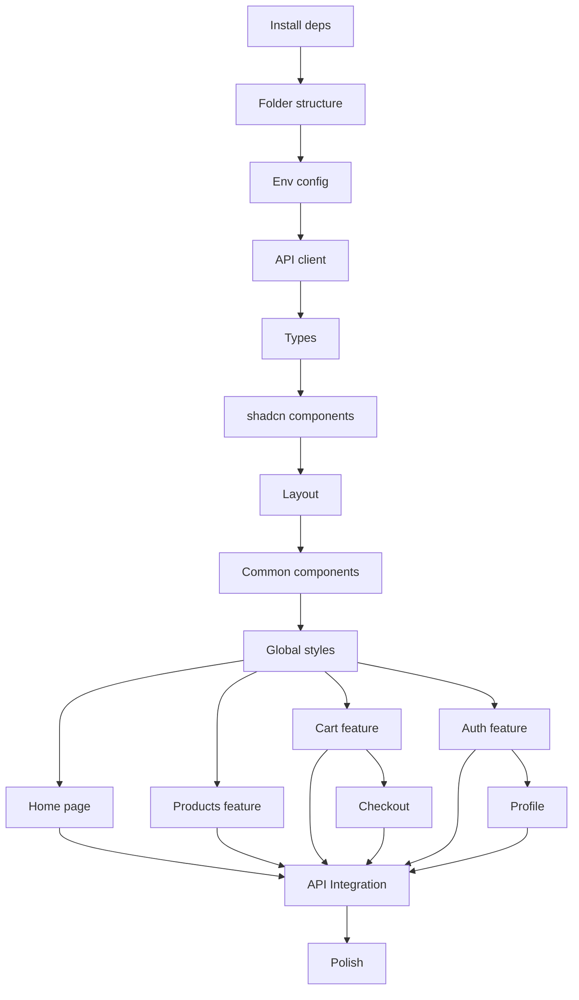

# Project Planning & Task Breakdown

## Milestones

**What are the major checkpoints?**

- [ ] **Milestone 1**: Foundation Setup (Day 1) - Project config, dependencies, folder structure
- [ ] **Milestone 2**: Core UI Components (Day 2-3) - Layout, shadcn components, base styling
- [ ] **Milestone 3**: Feature Implementation (Day 4-7) - All pages and features
- [ ] **Milestone 4**: API Integration (Day 8-9) - Connect to backend
- [ ] **Milestone 5**: Polish & Testing (Day 10) - Animations, testing, optimization

## Task Breakdown

**What specific work needs to be done?**

### Phase 1: Foundation Setup

- [ ] **Task 1.1**: Install dependencies
  - React Router v7
  - TanStack Query
  - Zustand
  - Framer Motion
  - Axios
- [ ] **Task 1.2**: Setup folder structure (feature-based)
- [ ] **Task 1.3**: Configure environment variables (.env)
- [ ] **Task 1.4**: Setup API client (Axios instance with interceptors)
- [ ] **Task 1.5**: Create TypeScript types (product, user, auth, cart)

### Phase 2: Core UI Components

- [ ] **Task 2.1**: Install shadcn/ui components
  - Button, Card, Input, Label
  - Select, Checkbox, RadioGroup
  - Sheet, Dialog, Dropdown
  - Avatar, Badge, Separator
  - Skeleton, Toast, Sonner
  - Form components
- [ ] **Task 2.2**: Create Layout components
  - Header (logo, nav, cart icon, user menu)
  - Footer (links, contact, social)
  - Navigation (desktop + mobile menu)
  - Main Layout wrapper
- [ ] **Task 2.3**: Create common components
  - ProductCard
  - LoadingSpinner
  - ErrorBoundary
  - EmptyState
  - Pagination
- [ ] **Task 2.4**: Setup global styles
  - Typography scale
  - Color tokens
  - Animation utilities

### Phase 3: Feature Implementation

#### 3.1 Home Page

- [ ] **Task 3.1.1**: Hero section (banner, CTA)
- [ ] **Task 3.1.2**: Featured products section
- [ ] **Task 3.1.3**: Category showcase
- [ ] **Task 3.1.4**: Benefits/USP section
- [ ] **Task 3.1.5**: Newsletter signup (UI only)

#### 3.2 Products Feature

- [ ] **Task 3.2.1**: Products list page
  - Product grid/list view toggle
  - Filter sidebar (category, price range, material)
  - Sort dropdown (price, name, date)
  - Pagination
- [ ] **Task 3.2.2**: Product detail page
  - Image gallery
  - Product info (name, price, description)
  - Quantity selector
  - Add to cart button
  - Related products
- [ ] **Task 3.2.3**: Products hooks (useProducts, useProduct)

#### 3.3 Cart Feature

- [ ] **Task 3.3.1**: Cart store (Zustand + persist)
- [ ] **Task 3.3.2**: useCart hook
- [ ] **Task 3.3.3**: Cart page
  - Cart items list (editable quantity)
  - Remove item
  - Cart summary (subtotal, total)
  - Proceed to checkout button
- [ ] **Task 3.3.4**: Cart icon in header (with item count)

#### 3.4 Checkout Feature

- [ ] **Task 3.4.1**: Checkout page
  - Shipping form
  - Payment form (simulated)
  - Order summary
  - Place order button
- [ ] **Task 3.4.2**: Order confirmation page

#### 3.5 Auth Feature

- [ ] **Task 3.5.1**: Auth store (Zustand + persist)
- [ ] **Task 3.5.2**: Login page
  - Login form (email, password)
  - Forgot password link (UI only)
  - Register link
- [ ] **Task 3.5.3**: Register page
  - Registration form
  - Validation
  - Success redirect
- [ ] **Task 3.5.4**: Protected route component
- [ ] **Task 3.5.5**: Auth hooks (useAuth, useCurrentUser)

#### 3.6 Profile Feature

- [ ] **Task 3.6.1**: Profile page
  - User info display
  - Edit profile form
  - Change password (UI only, backend không có endpoint)
- [ ] **Task 3.6.2**: useProfile hook

### Phase 4: API Integration

- [ ] **Task 4.1**: Products API integration
  - GET /products (list with filters)
  - GET /products/:id (detail)
- [ ] **Task 4.2**: Auth API integration
  - POST /auth/login
  - POST /auth/refresh (auto refresh)
  - POST /auth/logout
- [ ] **Task 4.3**: Users API integration
  - POST /users (register)
  - GET /users/:id (profile)
  - PATCH /users/:id (update profile)
- [ ] **Task 4.4**: Error handling và loading states

### Phase 5: Polish & Optimization

- [ ] **Task 5.1**: Add Framer Motion animations
  - Page transitions
  - Component animations
  - Hover effects
- [ ] **Task 5.2**: Responsive testing và fixes
- [ ] **Task 5.3**: Performance optimization
  - Lazy loading routes
  - Image optimization
  - Bundle analysis
- [ ] **Task 5.4**: Accessibility audit
- [ ] **Task 5.5**: Final testing

## Dependencies

**What needs to happen in what order?**



### External Dependencies

- Backend API phải đang chạy để test integration
- Sample data trong database

## Timeline & Estimates

**When will things be done?**

| Phase               | Tasks     | Estimate    | Cumulative |
| ------------------- | --------- | ----------- | ---------- |
| Phase 1: Foundation | 5 tasks   | 2-3 hours   | Day 1      |
| Phase 2: Core UI    | 4 tasks   | 4-5 hours   | Day 1-2    |
| Phase 3: Features   | 15+ tasks | 12-16 hours | Day 2-5    |
| Phase 4: API        | 4 tasks   | 4-5 hours   | Day 5-6    |
| Phase 5: Polish     | 5 tasks   | 3-4 hours   | Day 6-7    |

**Total Estimate**: 25-35 hours (5-7 days)

## Risks & Mitigation

**What could go wrong?**

| Risk                              | Impact | Probability | Mitigation                   |
| --------------------------------- | ------ | ----------- | ---------------------------- |
| Backend API không hoạt động       | High   | Low         | Mock data fallback           |
| shadcn/ui component không phù hợp | Medium | Low         | Custom styling / alternative |
| Performance issues                | Medium | Medium      | Lazy loading, optimization   |
| Browser compatibility             | Low    | Low         | Polyfills, testing           |

## Resources Needed

**What do we need to succeed?**

### NPM Packages

```json
{
  "dependencies": {
    "react-router": "^7.0.0",
    "@tanstack/react-query": "^5.x",
    "zustand": "^5.x",
    "framer-motion": "^11.x",
    "axios": "^1.x",
    "zod": "^3.x",
    "react-hook-form": "^7.x",
    "@hookform/resolvers": "^3.x"
  }
}
```

### shadcn/ui Components

- button, card, input, label, textarea
- select, checkbox, radio-group, switch
- sheet, dialog, dropdown-menu, popover
- avatar, badge, separator
- skeleton, toast, sonner
- form, table, tabs
- carousel (for product gallery)
- accordion (for FAQ/product details)

### Environment Variables

```env
VITE_API_URL=http://localhost:3000
VITE_APP_NAME=Furniture Store
```
