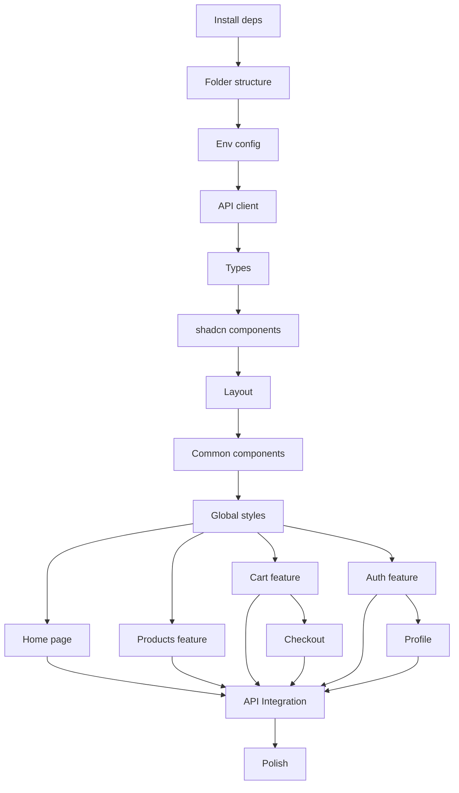

# Project Planning & Task Breakdown

## Progress Summary

**Last Updated**: 2024-12-19

### Overall Progress

- ✅ **Phase 1: Foundation Setup** - 5/5 tasks completed (100%)
- ✅ **Phase 2: Core UI Components** - 4/4 tasks completed (100%)
- 🟡 **Phase 3: Feature Implementation** - 18/18 tasks completed (100%)
  - ✅ 3.1 Home Page - 5/5 tasks (100%)
  - ✅ 3.2 Products Feature - 3/3 tasks (100%)
  - ✅ 3.3 Cart Feature - 4/4 tasks (100%)
  - ✅ 3.4 Checkout Feature - 2/2 tasks (100%)
  - ✅ 3.5 Auth Feature - 5/5 tasks (100%)
  - ⏳ 3.6 Profile Feature - 0/2 tasks
- ⏳ **Phase 4: API Integration** - 0/4 tasks completed
- ⏳ **Phase 5: Polish & Optimization** - 0/5 tasks completed

### Completed Tasks

- ✅ All foundation setup (dependencies, folder structure, env, API client, types)
- ✅ All core UI components (shadcn/ui, layout, common components, global styles)
- ✅ Cart store (created early for Header integration)
- ✅ Auth store (created early for API client integration)
- ✅ **Home Page - All 5 sections completed:**
  - Hero section với banner, CTA buttons, Framer Motion animations
  - Featured products section (ready for API integration)
  - Category showcase với 8 categories và icons
  - Benefits/USP section với 4 benefit cards
  - Newsletter signup form (UI only)

### Next Steps

1. Continue with Phase 3: Feature Implementation
   - ✅ Home Page components (COMPLETED)
   - 🟡 Products feature (list, detail, hooks) - NEXT
   - Cart page and hooks
   - Checkout pages
   - Auth pages (login, register)
   - Profile page

## Milestones

**What are the major checkpoints?**

- [x] **Milestone 1**: Foundation Setup (Day 1) - Project config, dependencies, folder structure ✅ **COMPLETED**
- [x] **Milestone 2**: Core UI Components (Day 2-3) - Layout, shadcn components, base styling ✅ **COMPLETED**
- [ ] **Milestone 3**: Feature Implementation (Day 4-7) - All pages and features
- [ ] **Milestone 4**: API Integration (Day 8-9) - Connect to backend
- [ ] **Milestone 5**: Polish & Testing (Day 10) - Animations, testing, optimization

## Task Breakdown

**What specific work needs to be done?**

### Phase 1: Foundation Setup ✅ **COMPLETED**

- [x] **Task 1.1**: Install dependencies ✅
  - React Router v7
  - TanStack Query
  - Zustand
  - Framer Motion
  - Axios
  - Zod, React Hook Form, @hookform/resolvers
- [x] **Task 1.2**: Setup folder structure (feature-based) ✅
- [x] **Task 1.3**: Configure environment variables (.env) ✅
- [x] **Task 1.4**: Setup API client (Axios instance with interceptors) ✅
- [x] **Task 1.5**: Create TypeScript types (product, user, auth, cart) ✅

### Phase 2: Core UI Components ✅ **COMPLETED**

- [x] **Task 2.1**: Install shadcn/ui components ✅
  - Button, Card, Input, Label, Textarea
  - Select, Checkbox, RadioGroup, Switch
  - Sheet, Dialog, DropdownMenu, Popover
  - Avatar, Badge, Separator
  - Skeleton, Sonner
  - Form, Table, Tabs, Carousel, Accordion, ScrollArea, AspectRatio
- [x] **Task 2.2**: Create Layout components ✅
  - Header (logo, nav, cart icon, user menu)
  - Footer (links, contact, social)
  - Navigation (desktop + mobile menu)
  - RootLayout wrapper
- [x] **Task 2.3**: Create common components ✅
  - ProductCard
  - LoadingSpinner
  - ErrorBoundary
  - EmptyState
  - Pagination
- [x] **Task 2.4**: Setup global styles ✅
  - Typography scale
  - Color tokens (Neutral theme)
  - Animation utilities (fade, slide, scale)

### Phase 3: Feature Implementation

#### 3.1 Home Page ✅ **COMPLETED**

- [x] **Task 3.1.1**: Hero section (banner, CTA) ✅
- [x] **Task 3.1.2**: Featured products section ✅
- [x] **Task 3.1.3**: Category showcase ✅
- [x] **Task 3.1.4**: Benefits/USP section ✅
- [x] **Task 3.1.5**: Newsletter signup (UI only) ✅

#### 3.2 Products Feature ✅ **COMPLETED**

- [x] **Task 3.2.1**: Products list page ✅
  - Product grid/list view toggle
  - Filter sidebar (category, price range, material)
  - Sort dropdown (price, name, date)
  - Pagination
- [x] **Task 3.2.2**: Product detail page ✅
  - Image gallery
  - Product info (name, price, description)
  - Quantity selector
  - Add to cart button
  - Related products
- [x] **Task 3.2.3**: Products hooks (useProducts, useProduct) ✅

#### 3.3 Cart Feature ✅ **COMPLETED**

- [x] **Task 3.3.1**: Cart store (Zustand + persist) ✅ _(Created early for Header integration)_
- [x] **Task 3.3.2**: useCart hook ✅
- [x] **Task 3.3.3**: Cart page ✅
  - Cart items list (editable quantity)
  - Remove item
  - Cart summary (subtotal, total)
  - Proceed to checkout button
- [x] **Task 3.3.4**: Cart icon in header (with item count) ✅ _(Integrated in Header component)_

#### 3.4 Checkout Feature ✅ **COMPLETED**

- [x] **Task 3.4.1**: Checkout page ✅
  - Shipping form
  - Payment form (simulated)
  - Order summary
  - Place order button
- [x] **Task 3.4.2**: Order confirmation page ✅

#### 3.5 Auth Feature ✅ **COMPLETED**

- [x] **Task 3.5.1**: Auth store (Zustand + persist) ✅ _(Created in Phase 1 for API client)_
- [x] **Task 3.5.2**: Login page ✅
  - Login form (email, password)
  - Forgot password link (UI only)
  - Register link
- [x] **Task 3.5.3**: Register page ✅
  - Registration form
  - Validation
  - Success redirect
- [x] **Task 3.5.4**: Protected route component ✅
- [x] **Task 3.5.5**: Auth hooks (useAuth, useCurrentUser) ✅

#### 3.6 Profile Feature

- [ ] **Task 3.6.1**: Profile page
  - User info display
  - Edit profile form
  - Change password (UI only, backend không có endpoint)
- [ ] **Task 3.6.2**: useProfile hook

### Phase 4: API Integration

- [ ] **Task 4.1**: Products API integration
  - GET /products (list with filters)
  - GET /products/:id (detail)
- [ ] **Task 4.2**: Auth API integration
  - POST /auth/login
  - POST /auth/refresh (auto refresh)
  - POST /auth/logout
- [ ] **Task 4.3**: Users API integration
  - POST /users (register)
  - GET /users/:id (profile)
  - PATCH /users/:id (update profile)
- [ ] **Task 4.4**: Error handling và loading states

### Phase 5: Polish & Optimization

- [ ] **Task 5.1**: Add Framer Motion animations
  - Page transitions
  - Component animations
  - Hover effects
- [ ] **Task 5.2**: Responsive testing và fixes
- [ ] **Task 5.3**: Performance optimization
  - Lazy loading routes
  - Image optimization
  - Bundle analysis
- [ ] **Task 5.4**: Accessibility audit
- [ ] **Task 5.5**: Final testing

## Dependencies

**What needs to happen in what order?**



### External Dependencies

- Backend API phải đang chạy để test integration
- Sample data trong database

## Timeline & Estimates

**When will things be done?**

| Phase               | Tasks    | Estimate    | Status         | Progress    | Cumulative |
| ------------------- | -------- | ----------- | -------------- | ----------- | ---------- |
| Phase 1: Foundation | 5 tasks  | 2-3 hours   | ✅ COMPLETE    | 5/5 (100%)  | Day 1      |
| Phase 2: Core UI    | 4 tasks  | 4-5 hours   | ✅ COMPLETE    | 4/4 (100%)  | Day 1-2    |
| Phase 3: Features   | 20 tasks | 12-16 hours | 🟡 IN PROGRESS | 18/20 (90%) | Day 2-5    |
| Phase 4: API        | 4 tasks  | 4-5 hours   | ⏳ PENDING     | 0/4 (0%)    | Day 5-6    |
| Phase 5: Polish     | 5 tasks  | 3-4 hours   | ⏳ PENDING     | 0/5 (0%)    | Day 6-7    |

**Total Estimate**: 25-35 hours (5-7 days)

## Risks & Mitigation

**What could go wrong?**

| Risk                              | Impact | Probability | Mitigation                   |
| --------------------------------- | ------ | ----------- | ---------------------------- |
| Backend API không hoạt động       | High   | Low         | Mock data fallback           |
| shadcn/ui component không phù hợp | Medium | Low         | Custom styling / alternative |
| Performance issues                | Medium | Medium      | Lazy loading, optimization   |
| Browser compatibility             | Low    | Low         | Polyfills, testing           |

## Resources Needed

**What do we need to succeed?**

### NPM Packages

```json
{
  "dependencies": {
    "react-router": "^7.0.0",
    "@tanstack/react-query": "^5.x",
    "zustand": "^5.x",
    "framer-motion": "^11.x",
    "axios": "^1.x",
    "zod": "^3.x",
    "react-hook-form": "^7.x",
    "@hookform/resolvers": "^3.x"
  }
}
```

### shadcn/ui Components

- button, card, input, label, textarea
- select, checkbox, radio-group, switch
- sheet, dialog, dropdown-menu, popover
- avatar, badge, separator
- skeleton, toast, sonner
- form, table, tabs
- carousel (for product gallery)
- accordion (for FAQ/product details)

### Environment Variables

```env
VITE_API_URL=http://localhost:3000
VITE_APP_NAME=Furniture Store
```
